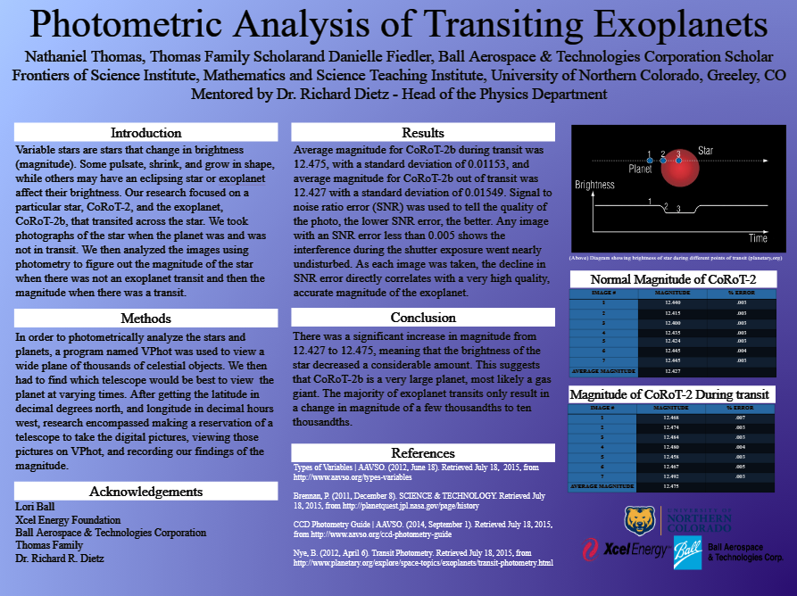

# Exoplanet Transit Photometry Repository

## Project Overview
This repository is a deep-dive into the photometric study of exoplanet transits—using raw, data-driven methods to capture the subtle dimming of starlight as planets pass in front of their host stars. With an inquisitive yet grounded approach, this project not only documents advanced analysis techniques but also questions and refines our understanding of planetary behavior in diverse stellar environments.

## Key Research Components
- **Photometric Analysis:** Detailed study of transit events with precise light curve reduction techniques.
- **Computational Extraction:** Methods to derive planetary characteristics from time-series photometric data.
- **Data Processing & Visualization:** Custom scripts for processing raw telescope images (captured via targeted reservations) and generating clear, comparative light curves.
- **Comparative Studies:** Evaluation of transit parameters across different stellar systems to challenge conventional models.

## Methodological Approach
- **High-Precision Data Reduction:** Refining light curves using both classical and novel statistical methods to highlight transient changes.
- **Transit Depth & Duration Analysis:** A critical assessment of magnitude shifts—our tests on CoRoT-2b, for example, showed an increase from 12.427 (out of transit) to 12.475 (during transit), indicating a notable dip in brightness and hinting at the planet’s substantial size.
- **Computational Modeling:** Simulation of both planetary and stellar parameters to validate observed phenomena.
- **Interdisciplinary Integration:** Merging traditional astronomical observation with modern data science to iterate on past assumptions and push forward a more nuanced understanding.

## Specific Focus: The Case of CoRoT-2b
At the heart of this repository lies an in-depth photometric study of CoRoT-2b—a hot Jupiter whose transit provided a compelling testbed for our methodologies. By leveraging tools like VPhot to sift through thousands of celestial images and reserving optimal telescope time, we critically analyzed changes in stellar brightness and correlated these with planetary dynamics.

## Technologies Utilized
- **Python:** The backbone for our data analysis scripts and computational modeling.
- **Astronomical Data Libraries:** Specialized packages for processing and interpreting photometric data.
- **Statistical Tools:** For rigorous signal-to-noise ratio (SNR) evaluation and error analysis, ensuring the integrity of each measurement.
- **Data Visualization:** Techniques that bring complex light curve data into a clear, interpretable format.

## Research Objectives
- **Quantify Exoplanet Characteristics:** From transit depth to orbital dynamics, every data point challenges our understanding of planetary formation and evolution.
- **Innovate Photometric Methodologies:** Refine and expand on current analytical techniques to improve accuracy and precision.
- **Expand Scientific Dialogue:** Offer an open, reproducible framework that encourages further questioning and testing within the exoplanet research community.
