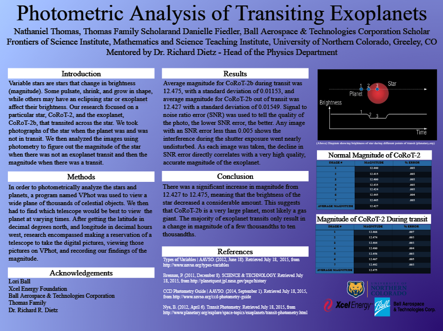

  <h1>Photometric Analysis of Transiting Exoplanets</h1>

Sponsored by **Xcel Energy** and **Ball Aerospace**  

## Overview

This repository demonstrates a streamlined approach to exoplanet photometry, merging object‑oriented C++/Java/Python programming with advanced astronomical analysis. The study focuses on CoRoT‑2b’s transit, revealing key insights through precise measurements of stellar brightness.

## Table of Contents
- [Overview](#overview)
- [Methodology](#methodology)
  - [Data Acquisition & Photometry](#data-acquisition--photometry)
  - [Analytical Approach](#analytical-approach)
- [Changelog](#changelog)
- [Contributing](#contributing)
- [Acknowledgements](#acknowledgements)
- [License](#license)
- [References](#references)

---

## Methodology

### Data Acquisition & Photometry

- **Observations:**  
  Data were captured using CCD cameras on telescopes in Australia, Spain, New Mexico, and California with 300‑second exposures during transit events.

- **Tools:**  
  VPhot was employed for data reduction and magnitude extraction.  
  - *Out‑of‑Transit:* Average magnitude ≈ 12.427 (σ ≈ 0.01549)  
  - *In‑Transit:* Average magnitude ≈ 12.475 (σ ≈ 0.01153)  
  - *Combined:* Overall average ≈ 12.451 (σ ≈ 0.01351)

### Analytical Approach

- **Background:**  
  By comparing light curves from before, during, and after transit, classical photometric methods merge with modern analysis to deduce planetary parameters.

- **Key Findings:**  
  - **Characteristics:**  
    CoRoT‑2b is a hot Jupiter—approximately 1.5× larger and 3.5× more massive than Jupiter.
  - **Transit Depth:**  
    At roughly 32%, the transit depth offers critical insights into the planet’s size and orbital dynamics.
  - **Data Quality:**  
    High‑quality images with SNR errors below 0.005 confirm the robustness of the measurements.

---

## Changelog

For a detailed history of updates, please refer to the [CHANGELOG.md](docs/CHANGELOG.md).

---

## Contributing

Contributions are welcome! For guidelines on improving data analysis or documentation, see [CONTRIBUTING.md](docs/CONTRIBUTING.md).

---

## Acknowledgements

Special thanks to **Xcel Energy** and **Ball Aerospace** for their sponsorship and support in advancing this research in exoplanet photometry.

---

## License

This project is licensed under the [MIT License](LICENSE).

---

## References

- **Types of Variables | AAVSO.**  
  AAVSO. Web. 28 June 2015. [https://www.aavso.org/types-variables](https://www.aavso.org/types-variables)

- **SCIENCE & TECHNOLOGY.**  
  PlanetQuest. Web. 28 June 2015. [http://planetquest.jpl.nasa.gov/page/history](http://planetquest.jpl.nasa.gov/page/history)

- **Transit Photometry.**  
  The Planetary Society Blog. Web. 28 June 2015. [https://www.planetary.org/articles/transit-photometry](https://www.planetary.org/articles/transit-photometry)

- **NASA.**  
  NASA. Web. 28 June 2015. [https://www.nasa.gov](https://www.nasa.gov)

- **NASA Exoplanet Archive.**  
  NASA Exoplanet Archive. Web. 28 June 2015. [https://exoplanetarchive.ipac.caltech.edu](https://exoplanetarchive.ipac.caltech.edu)

- **NASA Kepler.**  
  NASA. Web. 28 June 2015. [https://www.nasa.gov/mission_pages/kepler/main/index.html](https://www.nasa.gov/mission_pages/kepler/main/index.html)

- **Guide to CCD Photometry.**  
  Photometry Guide. Cambridge: AAVSO, 2014. 1‑82. Print. [https://www.aavso.org/sites/default/files/ccd_photometry_guide/CCDPhotometryGuide.pdf](https://www.aavso.org/sites/default/files/ccd_photometry_guide/CCDPhotometryGuide.pdf)

- **Online Photometry – Remote Internet Telescope Network – Online Imaging & Telescope Hosting Service.**  
  Web. 1 July 2015. [https://www.itelescope.net/](https://www.itelescope.net/)

- **Photometrica Tutorial 1, Introduction.**  
  Kenmogul's Library. Web. 1 July 2015. [https://www.screencast.com/users/kenmogul/folders/Default/media/f5ae741d-404e-4e18-bf28-b0aedbc23d8](https://www.screencast.com/users/kenmogul/folders/Default/media/f5ae741d-404e-4e18-bf28-b0aedbc23d8)

- **CoRoT‑2a: Star Blasts Planet With X‑rays [Photograph].**  
  (2011). Retrieved from [http://chandra.harvard.edu/photo/2011/corot/corot_lg.jpg](http://chandra.harvard.edu/photo/2011/corot/corot_lg.jpg)
